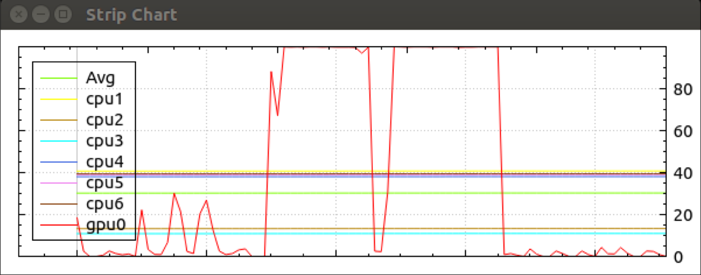

# Jetson TX2 Strip Chart

CPU and GPU usage strip chart. The script is a standalone script that prints a table of percentages uses of each cpu and the gpu0.
This can be fed in to the stripchart executable (in the zipfile) to create a plot.

## Usage

Unzip the zipfile into a folder, cd to the folder, then:

./cpu_usage.sh -p -v

Optionally you can install the binary `stripchart` into /usr/local/bin/

